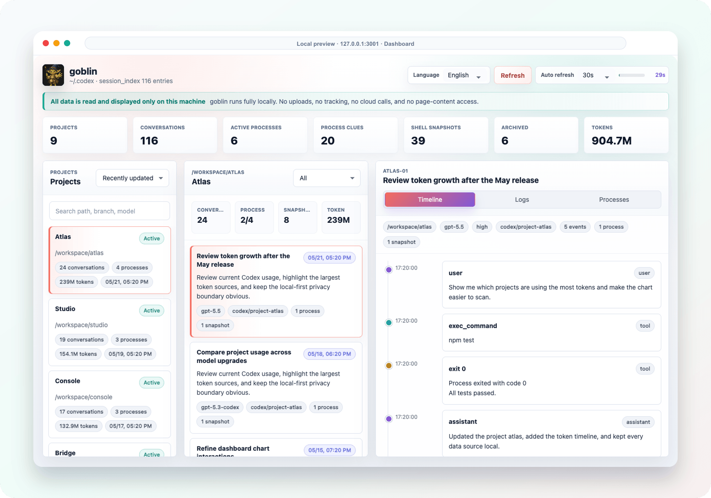

# goblin

[English](./README.md) | [中文](./README.zh-CN.md)

<p align="center">
  
</p>

<p align="center">
  = 20" height="28" />
  
  
  
  
</p>


goblin is a local-first console for Codex projects. It turns the data already stored under `~/.codex` into a browsable dashboard for projects, conversations, rollout history, process clues, shell snapshots, and token usage.

The privacy rule is intentionally small: **all data is read and displayed only on this machine**. goblin does not upload, track, inject pages, or call cloud services.

## What It Shows

| Area | Use it to answer | View |
| --- | --- | --- |
| Projects | Which workspaces are active, expensive, or recently touched? | Project list, summary cards, token atlas |
| Conversations | Which threads used the most tokens or produced snapshots? | Searchable thread list, Top-N, Pareto, table |
| Timeline | What happened inside one Codex thread? | User messages, assistant messages, tool calls, outputs |
| Processes | Which local process clues appear in Codex logs? | Active process cards and process-centered traces |
| Tokens | How did token usage move over time? | Line chart across all projects or one selected project |
| Extension | Can I open the dashboard without a local HTTP server? | Chrome popup with Native Messaging |

## Quick Start

### 1. Prerequisites

| Dependency | Purpose | Requirement |
| --- | --- | --- |
| Node.js | Run the local server, tests, Native Host, and extension build scripts. | `>=20` |
| SQLite CLI | Read Codex `state_5.sqlite` and `logs_2.sqlite`. | `sqlite3` command |
| Codex local cache | Provide project, thread, rollout, log, and snapshot data. | Default `~/.codex` |
| Google Chrome | Load the unpacked extension and use Native Messaging. | Manifest V3 |

goblin has no npm runtime dependencies.

### 2. Run The Web UI

```bash
npm run dev
```

Open `http://127.0.0.1:3001`.

You can override the port or Codex data directory:

```bash
PORT=3010 CODEX_HOME=/path/to/.codex npm run dev
```

The UI opens in Chinese by default. Use the language selector in the top bar to switch to English; the preference is stored in local browser storage only.

## Screenshots

The screenshots below use sanitized demo data so paths, thread titles, and usage numbers are safe to share.

### Dashboard

The main view keeps the operating surface dense: metric cards at the top, projects on the left, conversations in the center, and the selected thread timeline on the right.



### Project Atlas

Click **Projects** to open the project-level token atlas. The default bubble chart is draggable, and the same page can switch to Top-N bars, Pareto, Treemap, or a sortable table.


### Token Timeline

Click **Tokens** to inspect usage over time. Keep all projects selected or filter the line chart to one workspace.


## Chrome Extension

The extension renders the same dashboard without starting the local HTTP server. Chrome talks to a local Native Host, and the Native Host reads only the allowlisted Codex data routes.

```text
Chrome Extension UI
  -> nativeMessaging
  -> native-host/codex-local-viewer-host.js
  -> allowlisted ~/.codex data sources
```

### 1. Build The Extension

```bash
npm run build:extension
```

### 2. Load It In Chrome

Open `chrome://extensions`, enable Developer Mode, and load `dist/chrome-extension` as an unpacked extension.

### 3. Install The Native Host

Copy the generated extension ID, then run:

```bash
npm run install:native-host -- <extension-id>
```

On macOS this writes:

```text
~/Library/Application Support/Google/Chrome/NativeMessagingHosts/com.goblin.codex_local_viewer.json
```

The installer also creates an executable launcher next to the manifest. Chrome starts Native Messaging hosts with a minimal GUI environment, so the launcher uses the absolute Node.js executable captured during installation.

If the popup reports `Native host has exited`, reinstall the Native Host with the current extension ID, reload the extension, and click `Check native host` again.

## Privacy Model

goblin keeps the boundary explicit:

- No uploads of conversations, logs, project paths, process data, or source snippets.
- No analytics, telemetry, crash reporting, ads, or tracking SDKs.
- The Chrome extension has no `host_permissions` and does not inject content scripts.
- The Native Host accepts fixed API routes only. It rejects arbitrary SQL, shell commands, and file paths.

See [PRIVACY.md](./PRIVACY.md) for the full privacy note.

## Data Sources

| Source | What goblin reads |
| --- | --- |
| `~/.codex/state_5.sqlite` | Thread metadata, project paths, titles, models, Git branches, rollout paths |
| `~/.codex/logs_2.sqlite` | Log rows, thread-to-process links, levels, recent activity |
| `~/.codex/sessions/**/rollout-*.jsonl` | Conversation history and tool-call timelines |
| `~/.codex/shell_snapshots/*.sh` | Saved Codex shell snapshots |

## API

| Route | Response |
| --- | --- |
| `GET /api/overview` | Project overview, recent conversations, and process hints |
| `GET /api/project?cwd=/path/to/project` | Conversations and processes for one project |
| `GET /api/thread/:id` | Rollout timeline, logs, processes, and shell snapshots for one thread |
| `GET /api/processes` | Process-centered log and thread aggregation |
| `GET /api/sources` | Data-source availability |

## Development

Run the focused checks before shipping changes:

```bash
npm test
npm run build:extension
```

## License

goblin is released under the [MIT License](./LICENSE). The current license file states `Copyright (c) 2026 thewind`.
