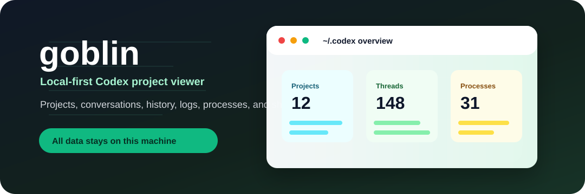
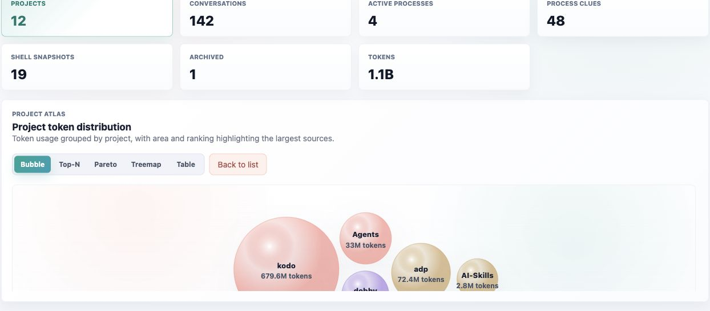
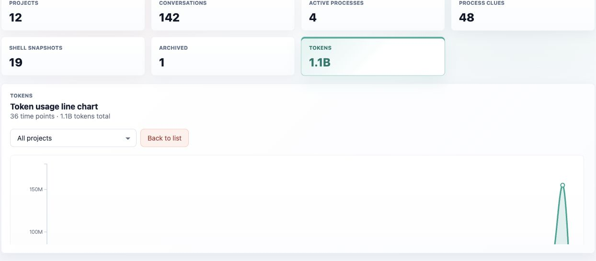

# goblin

[English](./README.md) | [中文](./README.zh-CN.md)

<p align="center">
  
</p>

<p>
  = 20" height="28" />
  
  
  
  
</p>



goblin is a local-first viewer for Codex projects, conversations, conversation history, log-backed process traces, and shell snapshots.

It reads data from the current machine only. It does not upload, track, inject web pages, or phone home. The web UI and Chrome extension both state clearly: **All data is read and displayed only on this machine**.

## Features

- Project overview: group Codex-managed work by workspace directory.
- Conversation browser: inspect titles, models, branches, token usage, archive state, and update time.
- History timeline: parse rollout JSONL into user messages, assistant messages, and tool calls.
- Process traces: aggregate `process_uuid` records from Codex logs and enrich active processes with local `ps` output.
- Shell snapshots: link saved Codex shell snapshots back to related threads.
- Bilingual UI: Chinese is the default, with an English switch in the top bar.
- Chrome extension: use the dashboard without starting a local HTTP server.

## Local-First Privacy

goblin keeps the boundary small and explicit:

- No uploads of conversations, logs, project paths, process data, or source snippets.
- No analytics, telemetry, crash reporting, ads, or tracking SDKs.
- The Chrome extension has no `host_permissions` and does not inject content scripts.
- The Native Host accepts fixed API routes only. It rejects arbitrary SQL, shell commands, and file paths.

See [PRIVACY.md](./PRIVACY.md) for the full privacy note.

## Dependencies

goblin has no npm runtime dependencies. It uses Node.js standard library APIs and a few local system tools.

| Dependency | Logo | Purpose | Requirement |
| --- | --- | --- | --- |
| Node.js |  | Run the local web server, Native Host, tests, and extension build script. | `>=20` |
| Google Chrome |  | Load the unpacked extension and provide Native Messaging. | Manifest V3 |
| SQLite CLI |  | Read Codex `state_5.sqlite` and `logs_2.sqlite`. | `sqlite3` command |
| Codex local cache |  | Provide project, thread, rollout, log, and shell snapshot data. | Default `~/.codex` |

## Quick Start

```bash
npm run dev
```

The default URL is `http://127.0.0.1:3001`. You can override the port or Codex data directory:

```bash
PORT=3010 CODEX_HOME=/path/to/.codex npm run dev
```

The web UI opens in Chinese by default. Use the language selector in the top bar to switch to English; the preference is stored locally in the browser.

## Screenshots

### Project Atlas

Click **Projects** to open the project-level token atlas. The default bubble chart is draggable, and the same view can switch to Top-N bars, Pareto, Treemap, or a table.



### Token Timeline

Click **Tokens** to inspect token usage over time. You can keep all projects selected or filter the line chart to a single project.



## Chrome Extension

The extension version does not require a local HTTP server. Chrome renders the UI, and a local Native Host reads Codex data on demand through Native Messaging.

```text
Chrome Extension UI
  -> nativeMessaging
  -> native-host/codex-local-viewer-host.js
  -> allowlisted ~/.codex data sources
```

Build the extension directory:

```bash
npm run build:extension
```

Open `chrome://extensions`, enable Developer Mode, and load `dist/chrome-extension` as an unpacked extension. Copy the generated extension ID, then install the Native Host:

```bash
npm run install:native-host -- <extension-id>
```

On macOS this writes:

```text
~/Library/Application Support/Google/Chrome/NativeMessagingHosts/com.goblin.codex_local_viewer.json
```

The Native Host manifest uses `allowed_origins` so only that extension ID can connect.

The installer also creates an executable launcher next to the manifest. Chrome starts Native Messaging hosts with a minimal GUI environment, so the launcher calls the absolute Node.js executable used during installation instead of relying on `env node`.

If the popup reports `Native host has exited`, reinstall the Native Host with the current extension ID:

```bash
npm run install:native-host -- <extension-id>
```

Then reload the extension in `chrome://extensions` and click `Check native host` again.

## Data Sources

- `~/.codex/state_5.sqlite`: thread metadata, project paths, titles, models, Git branches, and rollout paths.
- `~/.codex/logs_2.sqlite`: log rows, thread-to-process links, levels, and recent activity.
- `~/.codex/sessions/**/rollout-*.jsonl`: conversation history and tool-call timelines.
- `~/.codex/shell_snapshots/*.sh`: Codex shell snapshots.

## API

- `GET /api/overview`: project overview, recent conversations, and process hints.
- `GET /api/project?cwd=/path/to/project`: conversations and processes for one project.
- `GET /api/thread/:id`: rollout timeline, logs, processes, and shell snapshots for one thread.
- `GET /api/processes`: process-centered log and thread aggregation.
- `GET /api/sources`: data-source availability.

## Development Checks

```bash
npm test
npm run build:extension
```

## License

goblin is released under the [MIT License](./LICENSE). The current license file states `Copyright (c) 2026 thewind`.
