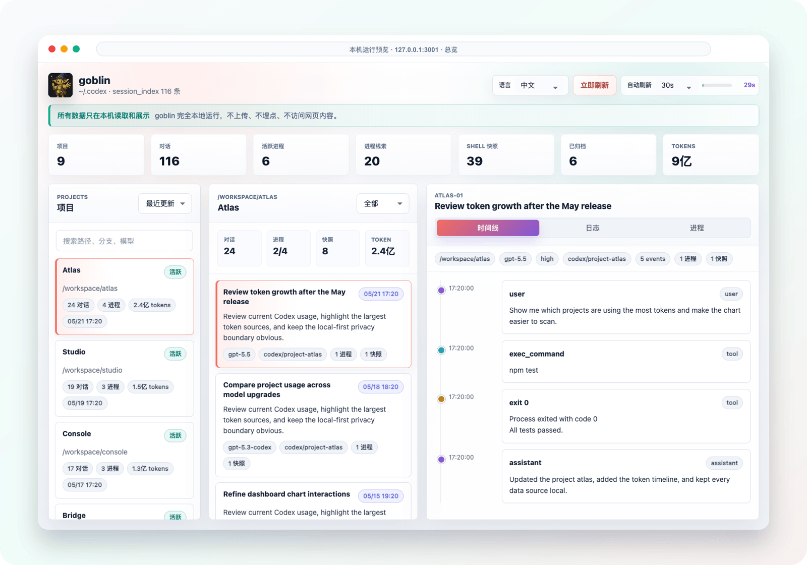
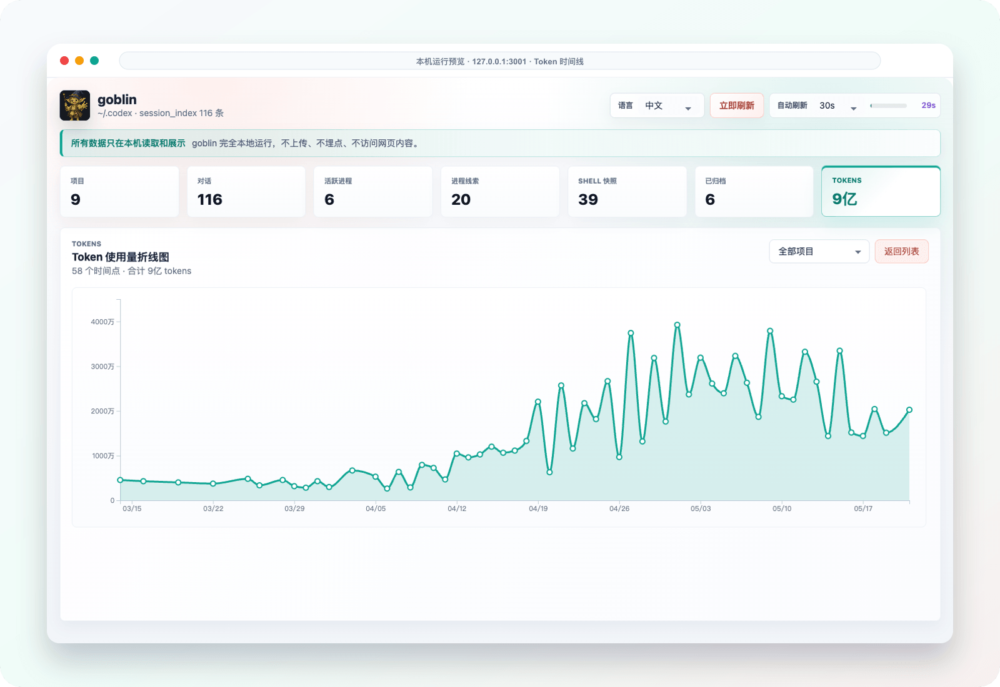

# goblin

[English](./README.md) | [中文](./README.zh-CN.md)

<p align="center">
  
</p>

<p align="center">
  = 20" height="28" />
  
  
  
  
</p>


goblin 是一个本地优先的 Codex 项目观测台。它把 `~/.codex` 里已经存在的数据整理成可浏览的仪表盘，用来查看项目、对话、rollout 历史、进程线索、shell 快照和 token 使用量。

隐私边界很明确：**所有数据只在本机读取和展示**。goblin 不上传、不埋点、不注入网页，也不会访问云端服务。

## 能看什么

| 模块 | 适合回答 | 视图 |
| --- | --- | --- |
| 项目 | 哪些工作区活跃、最近更新、token 消耗最高？ | 项目列表、摘要卡片、项目 token atlas |
| 对话 | 哪些线程 token 最多、哪些线程有快照或进程线索？ | 可搜索对话列表、Top-N、Pareto、表格 |
| 时间线 | 一个 Codex 对话里实际发生了什么？ | 用户消息、助手消息、工具调用、工具输出 |
| 进程 | Codex 日志里出现了哪些本机进程线索？ | 活跃进程卡片、按进程聚合的 trace |
| Tokens | token 使用量随时间怎么变化？ | 全项目或单项目折线图 |
| 插件 | 不启动本地 HTTP 服务能不能看仪表盘？ | Chrome popup + Native Messaging |

## 快速启动

### 1. 依赖

| 依赖 | 用途 | 要求 |
| --- | --- | --- |
| Node.js | 启动本地服务、运行测试、Native Host 和扩展构建脚本。 | `>=20` |
| SQLite CLI | 读取 Codex 的 `state_5.sqlite` 和 `logs_2.sqlite`。 | 需要 `sqlite3` 命令 |
| Codex 本机缓存 | 提供项目、对话、rollout、日志和 shell snapshot 数据。 | 默认 `~/.codex` |
| Google Chrome | 加载 unpacked extension，并提供 Native Messaging 通道。 | Manifest V3 |

goblin 没有 npm 运行时依赖。

### 2. 启动 Web UI

```bash
npm run dev
```

打开 `http://127.0.0.1:3001`。

可以通过环境变量覆盖端口或 Codex 数据目录：

```bash
PORT=3010 CODEX_HOME=/path/to/.codex npm run dev
```

Web UI 默认显示中文。顶部语言选择器可以切换到 English，偏好只保存在本机浏览器里。

## 运行截图

下面的截图使用脱敏演示数据生成，路径、对话标题和使用量数字都可以安全展示。

### 总览

主界面保持高密度工作台布局：顶部是指标卡片，左侧是项目，中间是项目下的对话，右侧是选中对话的时间线。



### 项目 Atlas

点击「项目」会进入项目级 token atlas。默认泡泡图可拖动，也可以切换为 Top-N 条形图、Pareto、Treemap 或表格。


### Token 时间线

点击「Tokens」可以查看 token 使用量随时间变化，也可以筛选到具体项目。



## Chrome 插件

扩展版不需要启动本地 HTTP 服务。Chrome Extension 只负责展示 UI，数据由本机 Native Host 读取后通过 Native Messaging 返回。

```text
Chrome Extension UI
  -> nativeMessaging
  -> native-host/codex-local-viewer-host.js
  -> 固定白名单内的 ~/.codex 数据源
```

### 1. 构建扩展目录

```bash
npm run build:extension
```

### 2. 在 Chrome 加载

打开 `chrome://extensions`，开启开发者模式，选择 `dist/chrome-extension` 作为 unpacked extension。

### 3. 安装 Native Host

加载后复制扩展 ID，再执行：

```bash
npm run install:native-host -- <extension-id>
```

macOS 上会写入：

```text
~/Library/Application Support/Google/Chrome/NativeMessagingHosts/com.goblin.codex_local_viewer.json
```

安装脚本还会在 manifest 旁边创建一个可执行 launcher。Chrome 启动 Native Messaging Host 时只有很少的 GUI 环境变量，所以 launcher 会使用安装时捕获到的 Node.js 绝对路径。

如果 popup 显示 `Native host has exited`，用当前扩展 ID 重新安装 Native Host，然后在 `chrome://extensions` 里重新加载扩展，再点击「检查本机组件」。

## 隐私边界

goblin 的边界保持简单清晰：

- 不上传 Codex 对话、日志、项目路径、进程信息或源码片段。
- 不包含 analytics、telemetry、crash reporting、广告或追踪 SDK。
- Chrome 扩展没有 `host_permissions`，也不注入 content script。
- Native Host 只接受固定 API 路由，不接受任意 SQL、shell 命令或文件路径。

更完整的说明见 [PRIVACY.md](./PRIVACY.md)。

## 数据源

| 数据源 | goblin 读取的内容 |
| --- | --- |
| `~/.codex/state_5.sqlite` | 对话元数据、项目路径、标题、模型、Git 分支和 rollout 路径 |
| `~/.codex/logs_2.sqlite` | 日志行、thread 与 process 的关联、日志等级和最近活跃时间 |
| `~/.codex/sessions/**/rollout-*.jsonl` | 对话历史与工具调用时间线 |
| `~/.codex/shell_snapshots/*.sh` | Codex 记录的 shell 快照 |

## API

| 路由 | 返回内容 |
| --- | --- |
| `GET /api/overview` | 项目总览、最近对话、进程线索 |
| `GET /api/project?cwd=/path/to/project` | 单个项目下的对话和进程聚合 |
| `GET /api/thread/:id` | 单个对话的 rollout 时间线、日志、进程和 shell 快照 |
| `GET /api/processes` | 按进程聚合的日志与关联对话 |
| `GET /api/sources` | 当前数据源可用性 |

## 开发检查

发布变更前建议跑这两个检查：

```bash
npm test
npm run build:extension
```

## License

goblin 使用 [MIT License](./LICENSE)。当前仓库 License 声明为 `Copyright (c) 2026 thewind`。
